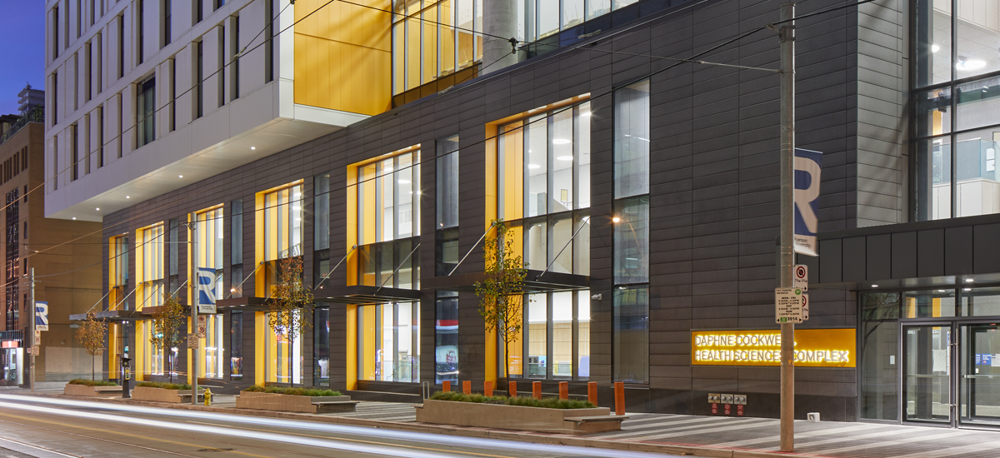

If you are a prospective undergraduate student, graduate student, or post-doctoral fellow interested in this research group and any related opportunities, please feel free to contact Dr. Young [via email](iyoung@torontomu.ca) with a copy of your CV and some information about your background and research interests. Contact details are as follows:

| School of Occupational and Public Health
| Toronto Metropolitan University
| 288 Church Street, DCC 320 Toronto, ON M5B 2K3
| Tel: +1 416-979-5000 Ext. 557614
| Email: <iyoung@torontomu.ca>

Campus directions and map: <https://www.torontomu.ca/maps/>


::: {.cell .column-screen-inset-shaded}
::: {.cell-output-display}
```{=html}
<div id="htmlwidget-70e2c1d4261d6212999c" style="width:100%;height:464px;" class="leaflet html-widget"></div>
<script type="application/json" data-for="htmlwidget-70e2c1d4261d6212999c">{"x":{"options":{"crs":{"crsClass":"L.CRS.EPSG3857","code":null,"proj4def":null,"projectedBounds":null,"options":{}}},"calls":[{"method":"addTiles","args":["https://{s}.tile.openstreetmap.org/{z}/{x}/{y}.png",null,null,{"minZoom":0,"maxZoom":18,"tileSize":256,"subdomains":"abc","errorTileUrl":"","tms":false,"noWrap":false,"zoomOffset":0,"zoomReverse":false,"opacity":1,"zIndex":1,"detectRetina":false,"attribution":"&copy; <a href=\"https://openstreetmap.org\">OpenStreetMap<\/a> contributors, <a href=\"https://creativecommons.org/licenses/by-sa/2.0/\">CC-BY-SA<\/a>"}]},{"method":"addMarkers","args":[43.65735,-79.37765,null,null,null,{"interactive":true,"draggable":false,"keyboard":true,"title":"","alt":"","zIndexOffset":0,"opacity":1,"riseOnHover":false,"riseOffset":250},"DCC Building",null,null,null,null,{"interactive":false,"permanent":false,"direction":"auto","opacity":1,"offset":[0,0],"textsize":"10px","textOnly":false,"className":"","sticky":true},null]}],"limits":{"lat":[43.65735,43.65735],"lng":[-79.37765,-79.37765]}},"evals":[],"jsHooks":[]}</script>
```
:::
:::

